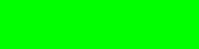
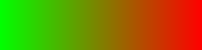
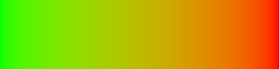
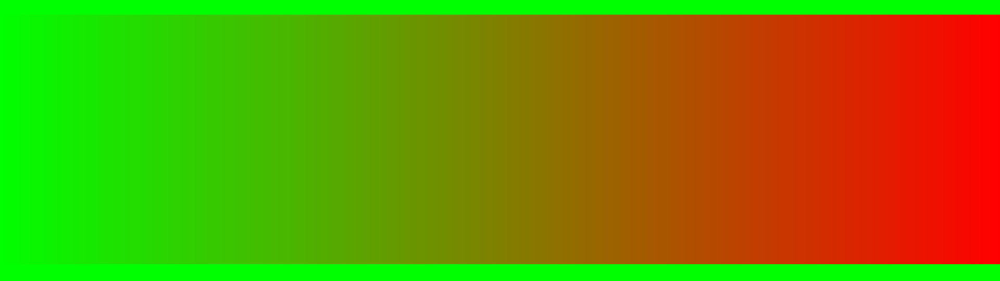
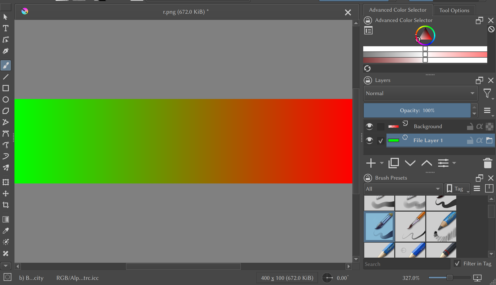
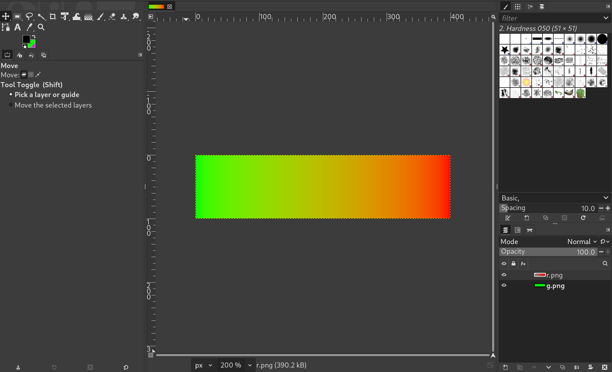
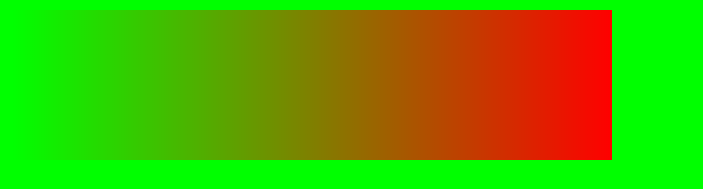
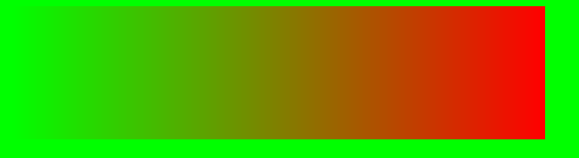

# Alpha, Gamma, sRGB: What I've learnt about colors in computers

So I finally spent a whole day diving into the mess of how colors are presented
and processed in today's computers (wanted to do this since a long time ago),
and now I feel like things are less of a mystery to me. Kinda surprised that I
got this far with just a day (it's afternoon today and I started digging into
this at noon yesterday). Lots of reading and experiments have been done before
over the past few years, of course.

In the last 2 years, I encountered these classics

- [WHAT EVERY CODER SHOULD KNOW ABOUT GAMMA](https://blog.johnnovak.net/2016/09/21/what-every-coder-should-know-about-gamma/)
- [How software gets color wrong](https://bottosson.github.io/posts/colorwrong/)

And yesterday I was implementing "correct" alpha blending myself. I couldn't
get it right, at least couldn't get it to be what I thought was right. Then I
started doing searches and now I think I understand it, and I believe there are
things I can add to these great articles.

I'll just write down what I've found, as a list of concepts, with later ones
building on top of previous ones.

## Color

A color is a feeling. Some electro-magnetic waves (also known as light) causes
a typical human to get a feeling when they hit the human's eyes. For an
idealized human in an idealized circumstance (refered to as just "human"
below), each combination of light with certain intensities[^intensity] and
wavelengths of the light corresponds to a certain feeling. Each of the feelings
is called a color.

[^intensity]: Meansuring light intensity is another huge and messy topic, and
I'm still not familiar about that, so I haven't decided what the physical
meaning of the "intensity" mentioned above should be. For now I assume it to be
[luminous intensity](https://en.wikipedia.org/wiki/Luminous_intensity).

## Colorspace

We store [colors](#color) as numbers in computers, so that we can recreate them
later.

We can store colors in different ways, as long as we know how to recreate them.

For instance, since colors correspond to combinations of light, when we want
store a color, we can measure the combination of the light that causes the
human to feel it, get an array of (wavelength, intensity) tuples. Later, we
use, say, some magical device we have to emit light so that what reaches the
human's eyes still have the combination of wavelengths and intensity.

With this setup, given a color, we can get numbers. Given numbers, we can get
colors. We call this setup a colorspace, and if we store such numbers as data,
we say that the data is in this colorspace.

## RGB Colorspace

The physiology of humans decides that, there are 3 special wavelengths, and by
combining light of the 3 wavelengths of different intensities, one can recreate
any color a typical human can perceive.

When pure light of the 3 wavelengths hit a typical human eye with an
appropriate intensity, they respectively causes the human to feel red, green,
blue, so let's just call light of the wavelengths R, G, B.

Thus, rather than array of (wavelength, intensity) tuples, we can store a color
as (R intensity, G intensity, B intensity) 3-tuples. Obviously, compared to
arrays of difference lengths and infinite possible wavelengths, these 3-tuples
are much easier to work with.

We can measure light corresponding to a color and find corresponding values for
R intensity, G intensity, and B intensity, so that with some
red-blue-green-only light-emitting device (much simpler than full-spectrum
ones) we can reproduce the color. So we do have a [colorspace](#colorspace)
here, and let's say that the 3-tuples are in the RGB colorspace.

## Linear RGB colorspace

An RGB colorspace is still very abstract. A color is stored as numbers, which
are intensities in a tuple. Of course intensities can be written as numbers,
but how exactly? What unit do we use? How exactly do we store the numbers as
bytes?

We can give different answers to the questions. With each answer combination,
we create an instance of the RGB colorspace. If the instance's (R intensity, G
intensity, B intensity) values form a [linear
map](https://en.wikipedia.org/wiki/Linear_map) with plain physical measurements
of intensity, we call it a linear RGB colorspace[^self], **but**, there is a
certain type of linear RGB colorspaces that we pay most attention to. In such a
colorspace, color data have the form (R value, G value, B value) such that

- When a value is 0, it means the lowest relevant[^relevant] intensity
- When a value is 1, it means the highest relevant intensity

[^relevant]: "relevant intensity" means different things in different instances
of colorspaces: **1.** lowest/highest intensity that humans can perceive.
**2.** lowest/highest intensity that a device can emit light for. **3.** etc.

Reference to such a linear RGB colorspace is so prevalent that "linear RGB
colorspace" mostly just means this kind of colorspace.

[^self]: And the RGB colorspace itself is of course also a linear RGB
colorspace.
  
## Gamma correction

Due to how they function, the optical components of a camera may give its
digital components colors in such a way:

    (data value) = intensity ^ (camera gamma)

The exponent is called "gamma" by convention.

This does not only happen in cameras, but also in many other optical/electrical
devices. Even the human eyes contribute to it due to different viewing
conditions.

Therefore, to make the computer monitor recreate the intensity stored in some
data, there needs to be a step:
  
    intensity = (data value) ^ gamma

Where this gamma cancels all the other gamma applied. Such cancellation is
called gamma correction.

There's more to gamma correction. The PNG specification has a nice tutorial
about it: https://www.w3.org/TR/PNG-GammaAppendix.html

## Gamma

See [gamma correction](#gamma-correction)

## CRT Gamma

In the past, the CRT monitors were the primary contributors to the need of gamma
correction. When color data were fed to them (as voltage applied to their
electron guns), they generally worked like this:
  
    intensity = (data value) ^ (CRT gamma)

By convention, intensity is represented by numbers in the [0-1 linear RGB
colorspace](#linear-rgb-colorspace) described above, and data values are
also numerized so that

- 1 corresponds to the highest relevant[^relevant] intensity
- 0 corresponds to the lowest relevant intensity

Within such convention, CRT gamma is generally 2.2-2.5.

To cancel their effect, [gamma correction](#gamma-correction) with a gamma of
value 1/(CRT gamma) needs to be done.

See also [the gamma tutorial in the PNG spec](https://www.w3.org/TR/PNG-GammaAppendix.html).

## 2.2 Gamma

In [the PNG specification gamma
tutorial](https://www.w3.org/TR/PNG-GammaAppendix.html), it mentioned that

> The original NTSC video standard required cameras to have a transfer function
with a gamma of 1/2.2, or about 0.45.

This is for gamma correction of that time, primarily to cancel the [CRT
gamma](#crt-gamma).

In other words, [gamma corrected](#gamma-correction) color data from that time
had their values being:
  
    (data value) = intensity ^ (1/2.2)

## Gamma colorspace

By [our definition of a colorspace](#colorspace), the [2.2-gamma-corrected
color data](#22-gamma) of course are in their own colorspace. I don't think
this is formalized any where, but conventionally it's often said that they are
in "the gamma colorspace".

## sRGB colorspace

sRGB colorspace[^srgb-draft] is a RGB colorspace that was developed for
accurate recreation of colors on different devices. It was designed at a time
where CRT monitors and [2.2-gamma-corrected](#22-gamma) data were prevalent. It
stores colors' red, blue and green values in a way so that **approximately**

    (sRGB value) = intensity ^ (1/2.2)

[^srgb-draft]: Draft of the standard: https://www.w3.org/Graphics/Color/sRGB.

This way, they stay somewhat compatible with data in the gamma colorspace.
Software that were written for data in the gamma colorspace can show sRGB
data somewhat correctly, for example.

sRGB's actual definition include more things, things like what the whitest
white is, what the redest red is, etc. so that newer software and devices that
take sRGB into account can more accurately store or recreate the color.

I will not put more details in the sRGB standard in this document, and wish
that you never need to implement conversion between sRGB and [linear
sRGB](#linear-srgb-colorspace) yourself.

## Importance of the sRGB colorspace

Today, sRGB is important because lots of things assume color data to be in
sRGB if they don't have (often don't accept) extra info.

An image viewer will assume a PNG file to be in sRGB and try to make your
monitor emit light calculated from its data using a function given by sRGB.

If you render to a GPU texture that is shown on screen, the data put into it
will be assumed to be in sRGB values. Also your choice of texture format (like
whether its `rgba8unorm` or `rgba8unorm-srgb`) does not affect this. They only
affect the data you read/write with the texture in your shader. Generally you
want to use a `-srgb` texture and write [linear sRGB](#linear-srgb-colorspace)
data to it in shaders.

etc. etc.

## sRGB and 2.2 Gamma

[The sRGB colorspace](#srgb-colorspace) is NOT [the gamma
colorspace](#gamma-colorspace). sRGB has different functions to convert to and
from the a linear RGB colorspace.

sRGB does intentionally approximate the gamma colorspace to be somewhat
compatible with color data that was gamma corrected for whatever correction
needs at that time. Therefore, applying a 1/2.2 or 2.2 gamma to some color data
to convert to and from sRGB is not entirely wrong, but is still not entirely
correct either. sRGB's own conversion functions are more complicated, so this
is still a pretty common shorthand/optimization, when one doesn't need to be
*that* correct.

## Human perception and intensity

The colors humans feel do not map linearly to intensities. Human eyes are
better at seeing differences in intensities at lower intensities. At a lower
intensity, a human may see a slight difference in intensity. If such a
difference appears at a higher intensity, not so much.

## 2.2 Gamma, sRGB and human perception

[sRGB](#srgb-colorspace) and [gamma colorspaces](#gamma-colorspace)' behavior
interestingly somewhat matches [human
feelings](#human-perception-and-intensity). At a lower intensity level, a
change in intensity correponds to a larger change in sRGB or gamma value,
compared to a same change at a higher intensity level.

The gamma colorspace certainly never meant to have such a property. It's just a
result of the need for [gamma correction](#gamma-correction) with past
technologies. I am not aware of sRGB having the intention to match human
perception this way, either. Therefore, such a matching is accidental, but is
considered favorable. In addition to the fact that as a data value change
matches human perception change, adjusting colors is more intuitive for artists
in those colorspaces, there's also storage efficiency consideration. The PNG
specification gamma tutorial explains it well:
https://www.w3.org/TR/PNG-GammaAppendix.html, in the "Gamma-encoded samples are
good" section.

## Linear sRGB colorspace

[sRGB](#srgb-colorspace) is more than just conversion to and from a linear
colorspace.

It also specifies things like what the whitest white is, what the redest red
is, etc. The [linear RGB colorspace](#linear-rgb-colorspace) that has all those
properties matching sRGB is called the linear sRGB colorspace.

## Alpha blending

[Alpha](#alpha) blending is the technique of combining multiple colors. It is
also called the `over` operator in Porter-Duff compositing. The formula of
producing the `result` of color data in a **linear**[^why-linear] RGB
colorspace `color 1` `over` `color2` is:
  
    (result alpha) = (color 1 alpha) + (color 2 alpha) * (1 - (color 1 alpha))
    (result R/G/B) = (
        (color 1 R/G/B) * (color 1 alpha) + (color 2 R/G/B) * (color 2 alpha) * (1 - (color 1 alpha))
    ) / (result alpha)

See [the alpha section](#alpha) for what the result means.

[^why-linear]: See [the Alpha blending and linear RGB colorspace
section](#alpha-blending-and-linear-rgb-colorspace) for why this has to be a
linear RGB colorspace.

## Alpha

Assume there is a shape, which is partially covered by an shape of a certain
color and partially covered by another shape of certain color (the later shapes
can cover each other, too), and we can only use one color to describe the
appearance of the whole shape, [the Porter-Duff `over`
operator](#alpha-blending) calculates the color.

In such calculations, by convention, each of the covering shape's colors carry
an extra component that is called `alpha` (so they go from (R value, G value, B
value) 3-tuples to (R value, G value, B value, alpha) 4-tuples), which denotes
the portion of the area of the lowest shape it covers. In other words, `alpha`
is a ratio of areas.[^porter-duff][^alpha-meaning]

[^porter-duff]: See https://www.w3.org/TR/compositing-1/#advancedcompositing

[^alpha-meaning]: So yes, alpha [does have an inherent
meaning](https://computergraphics.stackexchange.com/questions/13473/how-is-the-alpha-value-treated-when-blending).
It's well-defined and the definition is simple and clear.

## Alpha and opacity

Alpha was not strictly defined to only be a ratio of areas by its authors.
Sometimes, it was also considered to be the opacity of a shape assuming that
the shape fully covers the lowest shape.[^porter-duff2]

[^porter-duff2]: See https://imaginary-institute.com/resources/TechNote10/TechNote10.html

Though alpha can mean either of the things, this document generally will stick
to the ratio of area meaning. The reason being, do you know the physics of
transparency/opacity? I certainly don't. Only the ratio of area meaning is
something that I can reason about.

[Alpha blending](#alpha-blending) works for both meanings. That's the guarantee
its creators gave us.

## Alpha blending and linear RGB colorspaces

Intuitively, [a ratio of areas](#alpha) linearly maps to the ratio of light
emitted among all light emitted from the whole shape. With such a definition,
alpha blending must have been designed to deal with physical light. Alpha
blending is a linear map, and linear maps are [operation
preserving](https://en.wikipedia.org/wiki/Linear_map#Definition_and_first_consequences),
so since alpha blending works on physical light, it works on any linear RGB
colorspace. However, the operation preserving property only holds when
operations are all linear. For any color data produced through non-linear
operations from [linear RGB colorspaces](#linear-color-space), alpha blending
is not designed to work, and directly applying alpha blending to them can be
said to be undefined behavior.[^no-non-linear-alpha] This includes color data
in the gamma, sRGB, and many other colorspaces.

[^no-non-linear-alpha]: And no, [even if both color data are from the same
colorspace](https://www.luoruiyao.cn/blog/the-ultimate-guide-to-alpha-compisition),
as long as it's not a linear RGB colorspace, alpha blending them is incorrect.
The results may look "not bad", but they are incorrect, as suggested in
variation 3 in
https://www.w3.org/TR/PNG-Decoders.html#D.Alpha-channel-processing.

## Premultiplying alpha

Premultiplying alpha is a common *optimization* technique.

Being an optimization, the only thing it changes is performance. So if you
[think premultiplying alpha gets you new colors, or have some fancy
indications](https://shi-yan.github.io/note_on_alpha_blending/), you got it
wrong.

As seen in the [alpha blending](#alpha-blending) equations, R/G/B values never
appear by themselves in the equations: they are always multiplied by the alpha
value that comes from the same color data. As a result, if we have

    R' = R * alpha
    G' = G * alpha
    B' = B * alpha

Alpha blending becomes

    (result alpha) = (color 1 alpha) + (color 2 alpha) * (1 - color 1 alpha)
    (result R'/G'/B') = (color 1 R'/G'/B') + (color 2 R'/G'/B') * (1 - (color 1 alpha))

The later equation becomes much simpler and we get rid of the division which
requires us to do a 0 check. Computers like this kind of equations much better.
As a result, for performance, it's common to keep R'/G'/B' data instead of
R/G/B data for a while if multiple alpha blending need to be done.

## "Storing alpha value linearly"

It is suggested here and there that alpha value should be "stored linearly".
[The PNG spec](https://www.w3.org/TR/PNG-Decoders.html#D.Alpha-channel-processing)
is often used as a reference.

It's a kinda funny suggestion. Now I understand that what they mean is just
that you shouldn't [apply gamma](#gamma-correction) on the alpha values (who'd
do that?), but such an expression is certainly confusing. When we use terms
like "linear RGB colorspace", "linear" isn't just an adjective here. It's a
relationship. It suggests that color data values in such a colorspace form
linear maps with physical light intensities. A value cannot be linear all by
itself[^self-linear], it has to be linear *against something*.

[^self-linear]: Well, technically it can, and it is, linear against itself, but
saying this is not very meaningful.

At this point, I understand that a alpha value is linear against area coverage.
That's not something that I can possibly know from hearing "alpha is stored
linearly" though.

## Alpha blending and sRGB or gamma colorspaces.

This is a huge gotcha. As mentioned [above](#alpha), alpha blending must happen
with color data in a linear RGB colorspace. Now let's blend blackest black (R:
0, G: 0, B: 0) and whitest white (R: 1, G: 1, B: 1) from the sRGB colorspace.
Give the black an alpha of 0.5 and white an alpha of 1 and perform `black over
white`. sRGB blackest black is same as linear sRGB blackest black. Same for
whitest white. So we can just directly apply [alpha blending](#alpha-blending).
Doing math, we get the result (R: 0.5, G: 0.5, B: 0.5). Now we need to convert
it to sRGB... And we get (R: 0.735, G: 0.735, B: 0.735).

So... Is this correct? If you've luckily never dealt with the alpha value
before, you may think this is correct. The math doesn't seem wrong, and what's
the problem with an white area half-covered by black [looks
brighter](#human-perception-and-intensity) than a (R: 0.5, G: 0.5, B: 0.5)
gray perfectly sitting in the middle?

But you've dealt with alpha before... In some image editing software, you've
adjusted alpha, and a middle alpha does create a value in the middle... In
CSS, `rgba(0, 0, 0, 0.5)` is indeed darker...

The 2 articles I mentioned at the top documents both had a kinda optimistic
tone with regards to how today's software are dealing with colorspaces. That
made me think I could use some common software for reference.

And all of the ones I tried, by default, give a middle gray for the
compositing. With extra experimentation, I found that, they did get to that
result by doing alpha blending on colors in the sRGB colorspace, [which is
wrong](#alpha-blending-and-linear-colorspaces).

The experiments I did are recorded in [a following
section](#alpha-blending-implementations).

I found online
[other](https://www.reddit.com/r/Unity3D/comments/z2jtks/why_alpha_blending_is_so_different_in_unity_and/)
[people](https://www.reddit.com/r/gamedev/comments/nds4h5/alpha_blending_and_srgb/)
who got to this result and asked questions, and unfortunately the people
answering all seemed as confused. Now that I have my own conclusions, hopefully
I can explain this better:

1. The (R: 0.735, G: 0.735, B: 0.735) result is correct. It *is* the sRGB values
that correspond to the overall light emitted by a half-black half-white area.
2. The intuition that a half-black and half-white area should look like middle
grey is wrong. It's an intuition that has been built from using [wrong
implementations](#alpha-blending-implementations).
3. A real-life perceptually half-transparent object works differently than
covering half light from beneath it. Half-alpha never meant to represent
perceptual half-transparency.
4. Do not [reference other software](#alpha-blending-implementations) for alpha
blending. Assume them to be wrong by default.
5. What if I do want *something* that represents half transparency when it goes
to half? Well, you're walking into an uncharted area I suppose... I'm not aware
of any well-known concept for that. Gimp, [which implements alpha blending
correctly](#alpha-blending-implementations), still has the tranditional
"opacity" bar for layers, so maybe you can check out how it does that. Also,
maybe there's something already in the creative industry or the academia?

## Alpha blending implementations

We'll check some existing implementations and see how they implement [alpha
blending](#alpha-blending).

Let's create a gradient that goes from transparent to red with
[ImageMagick](https://imagemagick.org/).

    magick -size 400x100 -define gradient:direction=east gradient:'#00000000-#ff0000' r.png


Then create the green background to blend to:

    magick -size 400x100 xc:'#00ff00' g.png



Now let's blend them.

    magick g.png r.png -composite blend1.png



And in the middle of the image we see exactly the darker area described in [How
software gets color wrong](https://bottosson.github.io/posts/colorwrong/). We
know that alpha blending are applied to sRGB values.

As [mentioned above](#srgb-importance), PNG files with no colorspace info are
generally assumed to contain sRGB values. ImageMagick does that and [explicitly
states](https://imagemagick.org/script/color-management.php) that that's what
they do.

To their credit, ImageMagick does mention in their documentation that when
doing operations such as blending you want to manually convert to the linear
RGB colorspace first. They just don't default to that.

    magick g.png -colorspace RGB r.png -colorspace RGB -composite -colorspace sRGB blend2.png



Now we get the correct result.

What about other software? Let's try imv.

    imv -b00ff00 r.png



So sRGB it is.

What about krita?



Also sRGB.

And what about gimp?



Wow. Good job GIMP. I should have used you as a reference sooner.

What about browsers? It was actually the brower CSS `rgba` that made me think
half-alpha is half-transparency. Let's use this HTML snippet

```html
    <html>
      <style>
        body {
          background: rgb(0, 255, 0);
        }
        div {
          background: linear-gradient(to right, rgba(0, 0, 0, 0), rgb(255, 0, 0));
          width: 400px;
          height: 100px;
        };
      </style>
      <body>
        <div/>
      </body>
    </html>
```

Chromium:


firefox:


Unsurprisingly, browsers blend with sRGB values.

Not trying to say anything bad about any of the ones I tried above, though.
These are all great software!
